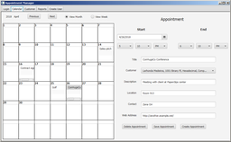

## Clement Cherlin, Entry-level Computer Programmer

I am a graduate of WGU Indiana with a Bachelor of Science in Software Development. My coursework focused on Java development. I created a mobile application for Android phones and tablets, using SQLite for persistence. I also created two desktop applications using JavaFX for the user interface, and MySQL for persistence.

### Mobile Application: Student Planner

Student Planner is an Android application for a student to schedule their terms, courses, and assessments (tests). It allows the student to attach notes to their courses and assessments with optional photos, add assessment times to their calendars, and share notes and photos with others.

#### Student Planner Screenshots

 <figure class="gallery-item">
    <a href="image/student-planner-home.jpg"><figcaption>Home screen</figcaption>
    </a>
</figure>
<figure class="gallery-item">
    <a href="image/student-planner-course-detail-with-mentor.jpg"><figcaption>Course detail</figcaption>
    </a>
</figure>
<figure class="gallery-item">
    <a href="image/student-planner-add-assessment.jpg"><figcaption>Add an assessment</figcaption>
    </a>
</figure>
<figure class="gallery-item">
    <a href="image/student-planner-edit-note.jpg"><figcaption>Edit a note</figcaption>
    </a>
</figure>

### Desktop Application: Appointment Manager

Appointment Manager allows the user to manage the schedules of multiple salespeople, each with multiple, possibly overlapping lists of clients. It automatically prevents scheduling multiple appointments for the same salesperson simultaneously. Both English and French localizations are available, and the user can switch between the two without restarting the application.

#### Appointment Manager Screenshots

<figure class="gallery-item">
    <a href="image/Appointment-manager-customer-screen.png"><figcaption>Customer tab</figcaption>
    </a>
</figure>
<figure class="gallery-item">
    <a href="image/Appointment-manager-calendar.png"><figcaption>Calendar tab</figcaption>
    </a>
</figure>
<figure class="gallery-item">
    <a href="image/Appointment-manager-french-localization.png"><figcaption>French localization of calendar tab</figcaption>
    </a>
</figure>

<figure>
    <a href="image/Appointment-manager-report-by-consultant.png"><figcaption>Consultant report</figcaption>
    </a>
</figure>
<figure>
    <a href="image/Appointment-manager-report-by-customer.png"><figcaption>Customer report</figcaption>
    </a>
</figure>

### Desktop Application: Inventory Manager

Inventory Manager demonstrates data storage with MySQL; maintaining referential integrity by warning the user when they attempt to delete a part that belongs to existing products; UI input validation; and a multiple-window interface.

#### Inventory Manager Screenshots

<figure class="gallery-item">
    <a href="image/Inventory-main-window.png"><figcaption>Main window</figcaption>
    </a>
</figure>
<figure class="gallery-item">
    <a href="image/Inventory-main-window-with-message.png"><figcaption>Main window with warning message</figcaption>
    </a>
</figure>
<figure class="gallery-item">
    <a href="image/Inventory-add-part.png"><figcaption>Add Part window</figcaption>
    </a>
</figure>
<figure class="gallery-item">
    <a href="image/Inventory-modify-product.png"><figcaption>Modify Product window</figcaption>
    </a>
</figure>

### World of Warcraft AddOn: Learning Aid

[Learning Aid](learningaid/index.html) is a World of Warcraft AddOn I wrote in Lua.