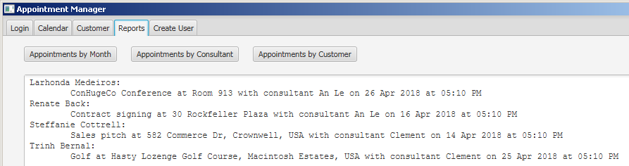

## Clement Cherlin, Entry-level Computer Programmer

I am a graduate of WGU Indiana with a Bachelor of Science in Software Development. My coursework focused on Java development. I created a mobile application for Android phones and tablets, using SQLite for persistence. I also created two desktop applications using JavaFX for the user interface, and MySQL for persistence.

### Mobile Application: Student Assistant

Student Assistant is an Android application for a student to schedule their terms, courses, and assessments (tests). It allows the student to attach notes to their courses and assessments with optional photos, add assessment times to their calendars, and share notes and photos with others.

### Desktop Application: Appointment Manager

Appointment Manager allows the user to manage the schedules of multiple salespeople, each with multiple, possibly overlapping lists of clients. It automatically prevents scheduling multiple appointments for the same salesperson simultaneously. Both English and French localizations are available, and the user can switch between the two without restarting the application.

#### Appointment Manager Screenshots

### Desktop Application: Inventory Manager

Inventory Manager demonstrates data storage with MySQL; maintaining referential integrity by warning the user when they attempt to delete a part that belongs to existing products; UI input validation; and a multiple-window interface.

#### Inventory Manager Screenshots

